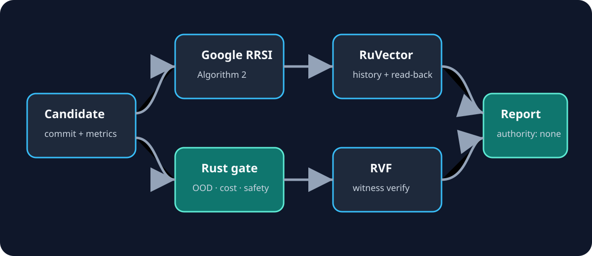
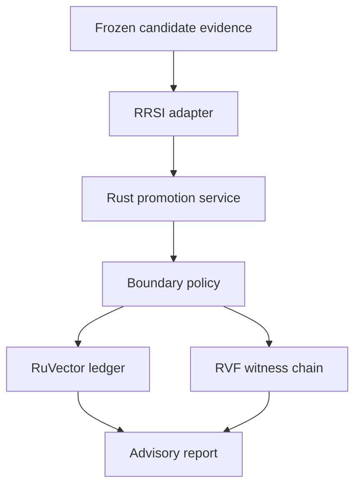
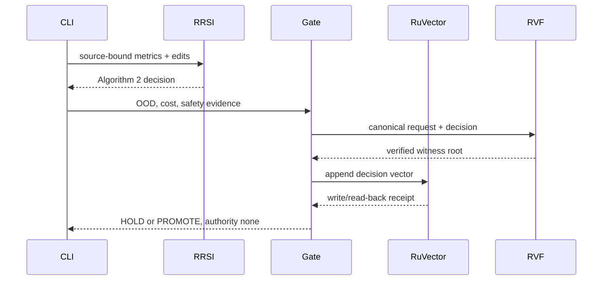

# EvoSeal

EvoSeal is an advisory promotion firewall for self-improving agent harnesses. It asks a narrow question: **does this exact, source-bound candidate earn promotion without overfitting, breaking safety policy, or losing its evidence trail?**

The implementation composes Google Research's pinned RRSI Algorithm 2 selection API with Ruvnet's RuVector persistence and RVF witness-chain primitives. MetaHarness Darwin and Flywheel remain external evaluators: they may propose and replay candidates, but EvoSeal never grants them publication or deployment authority.

> Maturity: experimental, review branch only. `authority: "none"` is emitted in every report. No candidate is automatically promoted, merged, deployed, or learned as policy.



## Capabilities

- invokes the real pinned Google RRSI Python APIs through a bounded JSON subprocess protocol;
- applies independent out-of-distribution, cost, and safety regression gates in Rust;
- records an eight-dimensional decision feature vector in a real persistent RuVector store and reads it back;
- creates and verifies an RVF SHAKE-256 witness chain over the canonical request and decision;
- exposes a usable Rust CLI, deterministic tests, a frozen ablation dataset, and a reproducible benchmark command;
- keeps evaluation, persistence, policy, and publication authority separate.

## Quickstart

```bash
git clone https://github.com/google-research/rrsi.git /tmp/rrsi
git -C /tmp/rrsi checkout be50316e1db05914068a973f322770ef08ed7ba1
export RRSI_SOURCE=/tmp/rrsi
cargo run -p evoseal-cli -- --input examples/promotion-request.json
```

Representative output:

```json
{
  "status": "PROMOTE",
  "reasons": [],
  "authority": "none",
  "rrsi": { "admissible": true, "edit_budget": 1 },
  "witness": { "entries": 2, "verified": true }
}
```

The output is a recommendation receipt, not authorization.

## Architecture





## Workspace map

| Crate | Responsibility |
|---|---|
| `evoseal-domain` | typed evidence, invariants, independent boundary policy |
| `evoseal-application` | ports and orchestration; no upstream types leak inward |
| `evoseal-adapter-rrsi` | timeout-bounded real RRSI subprocess integration |
| `evoseal-adapter-ruvnet` | persistent RuVector decision ledger and RVF witness chain |
| `evoseal-cli` | JSON input/output vertical slice |
| `evoseal-evaluation` | frozen baselines, ablations, and benchmark driver |

## Upstream composition

| Ingredient | Pinned source | License | Executed path |
|---|---|---|---|
| Google RRSI | `be50316e1db05914068a973f322770ef08ed7ba1` | Apache-2.0 | `RRSIConfig`, `edit_budget`, `select_round` through `rrsi_bridge.py` |
| RuVector | `ruvector-core 2.3.1` | MIT | file-backed insert, nearest-history query, read-back |
| RVF | `rvf-crypto 0.2.0` | MIT/Apache-2.0 dependency chain | SHAKE-256 action hashes, witness create/verify |
| MetaHarness Darwin | source `9ce8b8dd89045c3b9a1f809ae58f3589029db4a4`; npm 0.10.3 | MIT | bounded candidate evaluation command, not promotion authority |
| MetaHarness Flywheel | source `9ce8b8dd89045c3b9a1f809ae58f3589029db4a4`; npm 0.1.12 | MIT | replay bundle verification, not promotion authority |

Registry artifacts do not expose `gitHead`; the npm versions and inspected source revision are recorded separately rather than falsely equated.

## Quality gates

```bash
cargo fmt --all -- --check
cargo clippy --workspace --all-targets --all-features --locked -- -D warnings
cargo test --workspace --all-targets --all-features --locked
RRSI_SOURCE=/tmp/rrsi cargo test -p evoseal-adapter-rrsi --test upstream -- --ignored
cargo deny check
cargo run --locked -p evoseal-evaluation --bin evoseal-eval -- --dataset evaluation/frozen-cases.json --iterations 10000
```

## Frozen benchmark

The dataset compares `score-only`, `rrsi-only`, and the combined gate. It is a mechanism fixture, not a production claim. Raw dated evidence is under `evidence/`; the benchmark table is updated only from executed output.

| Strategy | Correct | Unsafe promotions | Purpose |
|---|---:|---:|---|
| score-only | 1/4 | 3 | demonstrates why improvement on one slice is insufficient |
| RRSI-only | 2/4 | 2 | preserves upstream selection semantics without EvoSeal boundary gates |
| EvoSeal | **4/4** | **0** | requires RRSI admissibility plus frozen OOD/cost/safety gates |

On the same frozen fixture, 10,000 combined-gate evaluations completed in 9,547,085 ns in the recorded debug build. This is a reproducibility timing, not a throughput claim. Darwin 0.10.3 evaluated the two gate parameters over two generations and retained the frozen baseline at 1.0 fixture accuracy. Flywheel 0.1.12 ran two authority-free generations, made zero promotions, and replay-verified every receipt and sealed field. See `evidence/` for raw output.

## Limitations

- The bounded integration calls RRSI selection and schedule APIs; it does not run live proposer, analyst, critic, or policy model roles without authorized Vertex configuration.
- The feature vector is intentionally inspectable and is not a semantic embedding.
- RuVector is the local evaluation ledger in this slice. Production deployment must use an IAM-scoped stateless service and RuVector as the sole intelligence layer backed by Cloud SQL PostgreSQL; no service-owned database is introduced here.
- RVF witnesses make tampering detectable; they do not establish the truth of the measurements.
- EvoSeal can recommend `PROMOTE`, but a human-owned release gate must decide KEEP/GRADUATE, REVISE, or DISCARD.

See [specification](docs/specification.md), [architecture](docs/architecture.md), [DDD](docs/ddd.md), [implementation contract](docs/implementation-contract.md), [research](docs/research.md), and [status](PROJECT_STATUS.md).
