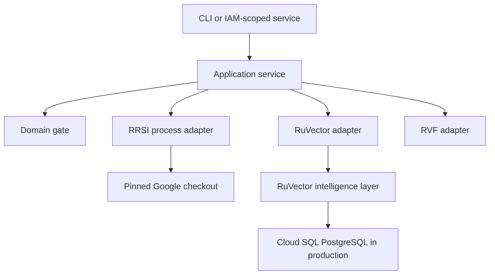

# Architecture

EvoSeal uses hexagonal boundaries so external optimizers and stores cannot leak their types into the promotion policy. The dependency direction is `CLI -> application -> domain`; adapters depend inward on application ports.

## Deployment view

The bounded local slice uses RuVector's file-backed store to execute and test the native Rust API. It does not introduce a second application database. A production adapter must keep the service stateless and route durable intelligence through RuVector backed by Cloud SQL PostgreSQL.

## Cancellation and timeout

The RRSI subprocess receives JSON only, inherits no secrets from project files, and is killed after the configured timeout. Non-zero exit, missing checkout, missing bridge, malformed JSON, and timeout are distinct errors. The CLI never retries a candidate under changed policy.

## Evidence order

1. validate source-bound input;
2. invoke RRSI;
3. evaluate frozen Rust boundary policy;
4. serialize request and decision canonically;
5. create and verify RVF witness chain;
6. write and read back RuVector history;
7. emit advisory report.

This order prevents an unverified or unpersisted recommendation from being represented as complete.

