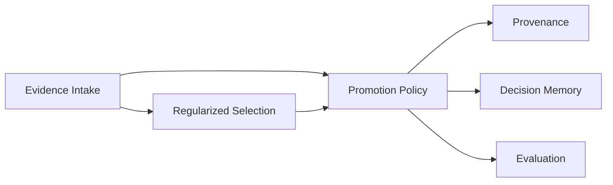

# Domain-driven design

## Ubiquitous language

- **Candidate**: one exact harness revision under evaluation.
- **Incumbent**: the exact currently accepted comparison revision.
- **Evidence slice**: scores, cost, and safety failures for one frozen dataset.
- **Admissible**: accepted by RRSI Algorithm 2; not equivalent to authorized promotion.
- **Boundary gate**: EvoSeal's independent OOD, cost, and safety checks.
- **Witness**: tamper-evident RVF chain binding request to decision.
- **Ledger receipt**: RuVector write/read-back identity and nearest prior decisions.
- **Promotion report**: advisory output with no execution authority.

## Bounded contexts

| Context | Aggregate / entities | Invariants | Owner |
|---|---|---|---|
| Evidence Intake | `PromotionRequest`, metric slices, component edits | commits exact; metrics finite; costs positive | domain crate |
| Regularized Selection | `RrsiResult` | pinned source; timeout; real Algorithm 2 output | RRSI adapter |
| Promotion Policy | `BoundaryDecision` | every failed gate produces HOLD | domain crate |
| Provenance | `WitnessReceipt` | chain verifies before report | RVF adapter |
| Decision Memory | `LedgerReceipt` | append and read back through RuVector | RuVector adapter |
| Evaluation | `FrozenCase`, `StrategyScore` | same cases for all strategies | evaluation crate |

## Aggregate roots and value objects

`PromotionRequest` is the intake aggregate. `CandidateEvidence`, `IncumbentEvidence`, `MetricSlice`, `ComponentEdit`, and `GatePolicy` are value objects. `PromotionReport` is the output aggregate assembled only after the RRSI, witness, and ledger ports succeed.

## Domain events

- `CandidateEvaluatedByRrsi`
- `BoundaryGateHeld`
- `BoundaryGatePassed`
- `WitnessVerified`
- `DecisionRecorded`

The MVP represents them in the final immutable report rather than an internal event bus.

## Context map

Selection is an anti-corruption adapter over Google RRSI. Decision Memory is an anti-corruption adapter over RuVector. Provenance is a thin adapter over RVF primitives. Only application orchestration coordinates the three; none can self-promote.

